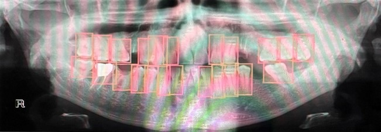
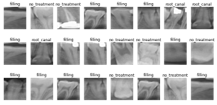
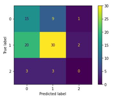
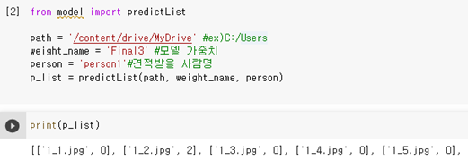
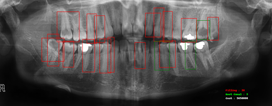

# Classification-of-tooth-decay
Classification of tooth decay

## 1.	Yolo로 개별 치아 crop하기

## Install

```python
%cd yourpath/Team1/yolov5
!pip install -r requirements.txt
```

## Usage

1) 개별 치아로 라벨링된 데이터로 yolo 학습하기

</img>

yolov5/data/coco128.yaml에 있는 train, val 및 test 파일 경로를 수정해야합니다.
또한 train.txt 및 val.txt 안에 있는 데이터 경로를 수정해야합니다.
```python
import torch
import glob

%cat yourpath/Team1/yolov5/data/coco128.yaml

os.chdir(‘yourpath/Team1/yolov5’)
!python train.py --img 416 --batch 16 --epochs 50 –data /yourpath/Team1/yolov5/data/coco128.yaml --cfg ./models/yolov5s.yaml --weights yolov5s.pt --name your_results_name
```
2) 학습된 yolo로 입 전체 X-ray 이미지 crop하기 
학습된 모델로 이미지(yolov5/data/unlabeled_jpg_te)를 개별 치아로 crop해줍니다.
crop된 치아는 yolov5/data/teethCrop폴더에 저장됩니다.
```python
from crop_img import crop

path = ‘yourpath/Team1’ #ex)C:/Users/Team1
model = torch.hub.load('.', 'custom', path = path+'/yolov5/runs/train/ your_results_name/weights/best.pt', source='local')                         
img_list = glob.glob(path+'/yolov5/data/unlabeled_jpg_te/*.jpg')
crop(path, img_list, model)
```


## 2.	Resnet으로 치아 우식 분류 학습하기

## Usage

1)	augmentain

</img>

우선 치아 우식을 라벨링하고, 라벨링된 폴더의 데이터를 8:2 비율로 train data set (/resnet/data/labeled)과 test data set(/resnet/data/labeled_test)으로 분리해주었습니다
그리고 train data set의 데이터를 flip 기능으로 data augmentation을 해주었습니다. 
여기서 path1은 라벨링된 파일들이 저장되어 있는 폴더이고, path2는 augmentation된 파일들이 저장될 폴더 경로입니다. 
Augmentation 함수를 사용하면 augmentation 폴더에 augmentation된 데이터+원본 데이터가 합쳐진 train data set이 형성됩니다.
```python
%cd yourpath/Team1/resnet

from augmentation_f import augmentation

path = ‘yourpath’ #ex)C:/Users
augmentation(path)
```
2)	Resnet Supervised learning
augmentation의 파일의 데이터를 resnet 모델 및 crossvalidation을 이용해 학습해줍니다. (resnet/saved_models/supervised_weights_crossval1에 미리 학습된 모델 가중치가 있습니다.)
```python
%cd yourpath/Team1/resnet

from model import res_train

path = ‘yourpath’ #ex)C:/Users
weight_name = ‘supervised_1’ #학습될 가중치 이름
res_train(path, weight_name)
```
3)	Resnet Semi-supervised learning
사전 학습된 가중치와 unlabeled dataset을 이용해, Semi-supervised learning을 진행합니다. (resnet/saved_models/Final3에 미리 학습된 모델 가중치가 있습니다.)
```python
%cd yourpath/Team1/resnet

from model import semi_train

path = ‘yourpath’ #ex)C:/Users
weight_name1 = ‘supervised_weights_crossval1’ #사전 훈련된 가중치 이름
weight_name2 = ‘ssl_1' #Semi-supervised learning으로 학습될 가중치 이름
semi_train(path, weight_name1, weight_name2)
```
4)	모델 평가하기 (confusion matrix)

</img>

평가하기 원하는 모델 가중치의 confusion matrix를 확인합니다.
```python
%cd yourpath/Team1/resnet

from model import confusion_m

path = ‘yourpath’ #ex)C:/Users
weight_name = ‘Final3’ #평가 모델 가중치
confusion_m(path, weight_name)
```


## 3.	학습된 모델로 치아 견적 산출하기
## Install
```python
%cd yourpath/Team1/yolov5
!pip install -r requirements.txt
```

## Usage

1)	한 사람의 개별 치아 분류 
견적을 내 줄 사람의 입 전체 데이터를 학습된 yolo 모델로 crop을 해준 후, 데이터들을 (/resnet/data/person)폴더에 저장해줍니다. 그리고 model.py의 predictList 함수를 사용하면, 사람의 개별 치아에 대한 클래스 값 리스트를 받을 수 있습니다.

</img>
```python
%cd yourpath/Team1/resnet

from model import predictList

path = ‘yourpath’ #ex)C:/Users
weight_name = ‘Final3’ #모델 가중치
person = ‘person1’#견적받을 사람명
p_list = predictList(path, weight_name, person)

classifications=[[]]

for i,j in p_list:
  classifications[0].append(j)

print(classifications)
```

2)	최종 견적 산출
```python
%cd yourpath/Team1

from PIL import Image
import matplotlib.pyplot as plt
import torch
from final import box_save, final_cost

path = ‘yourpath/Team1’
img = Image.open(path+'/yolov5/data/unlabeled_jpg_te/78.jpg')
model = torch.hub.load('.', 'custom', path=path+'/yolov5/runs/train/ your_results_name/weights/best.pt', source='local')   

coordinates = box_save(path, img, model)
final_cost(path, img, classifications, coordinates)
```
</img>
